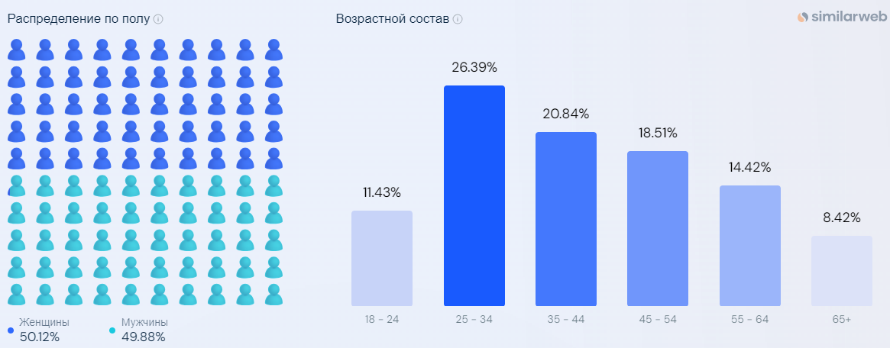

# Booking

## Содержание:
1. [Тема и целевая аудитория.](#1)
2. [Расчёт нагрузки.](#2)
3. [Глобальная балансировка нагрузки.](#3)
4. [Локальная балансировка нагрузки.](#4)
5. [Логическая схема базы данных.](#5)
6. [Физическая схема базы данных.](#6)
8. [Технологии.](#8)
9. [Обеспечение надёжности.](#9)
10. [Схема проекта.](#10)
11. [Список серверов.](#11)
---

## 1. Тема и целевая аудитория. <a name="1"></a>

**Booking.com** — система интернет-бронирования отелей, основанная в 1996 году в Амстердаме (Нидерланды).
Компания прошла путь от маленького голландского стартапа до одного из мировых цифровых лидеров в сфере путешествий. Миссия Booking.com, подразделения Booking Holdings Inc. (NASDAQ: BKNG), — делать путешествия доступными каждому.


### MVP

- Поиск с фильтрами по объявлениям.
- Объявления с фотографиями.
- Бронирование объявлений.
- Профиль арендодателя.
- Рейтинг арендодателя.
- Профиль арендатора.
- Рейтинг арендатора.
- Статус объявления.


### Целевая аудитория

Согласно информации с [Booking.com](https://www.booking.com/content/about.en-gb.html), [hypestat](https://hypestat.com/info/booking.com) и [businessofapps](https://www.businessofapps.com/data/booking-statistics/):

- 500+ миллионов посещений в месяц.
- 18+ миллионов пользователей в день.
- В 2022 было забронировано 895 миллионов ночей.
- Самая многочисленная возрастная группа посетителей: 25 - 34 лет.
- В среднем, пользователи проводят на ресурсе более 8 минут за сессию.
- В среднем, пользователи на сайте открывают 8 страниц за сессию.

#### Демография аудитории Booking



#### Количество пользователей Booking по странам

| Страна            | Процент пользователей от общего числа |
|-------------------|:-------------------------------------:|
| Соединенные Штаты |                 10.06%                 |
| Великобритания    |                 7.89%                  |
| Германия          |                 7.38%                  |
| Франция           |                 5.61%                  |
| Италия            |                 5.59%                  |


Предположим, что в booking.com зарегистрировано 500 миллионов пользователей-арендаторов и 10 миллионов пользователей-арендодателей.
Также, учитывая данные исследовния [OneTwoTrip](https://ria.ru/20190913/1558631353.html), возьмем, что в 5% случаев арендаторы оставляют отзывы после каждой брони жилья. Преположим, что в среднем каждый пользователь за все время существования сервиса сделал 5 бронирований. Получим:
```
500.000.000 * 5 * 0.05 = 125.000.000
```
Будем считать, что число всех отзывов об арендадателе и арендаторе равно, т.е. 125 миллионов у арендаторов и арендадателей. В среднем объявление может содержать до 10 картинок. В сервисе размещается до 30 000 000 объявлений.

---

## 2. Расчет нагрузки. <a name="2"></a>

### Продуктовые метрики

Согласно [hypestat](https://hypestat.com/info/booking.com) количество уникальных пользователей в день составляет около
**18M** (DAU).
Месячная аудитория составляет **550M** активных пользователей (MAU).

Средний размер профиля пользователя включающим в себя персональные данные пользователя, никнейм, аватар и контактные данные(номер телефона, email) равным 1.5 КБ.

Используя данные с [similarweb](https://www.similarweb.com/ru/website/booking.com/#geography) возьмем данное разбиение по регионам:

| Регион                  | Процент от общего количества пользователей |    MAU    |   DAU   |
|-------------------------|--------------------------------------------|-----------|---------|
| Северная Америка        |                     25%                    | 137.5 млн | 4.5 млн |
| Южная Америка           |                     15%                    | 85.5  млн | 2.7 млн |
| Европа                  |                     35%                    | 192.5 млн | 6.3 млн |
| Азия (влючая Австралию) |                     20%                    | 110   млн | 3.6 млн |
| Африка                  |                      5%                    | 27.5  млн | 0.9 млн |

#### Среднее значение действий пользователя в день:

| Действие                          | Среднее количество в день на пользователя |
|-----------------------------------|-------------------------------------------|
| Поиск по параметрам               | 2                                         |
| Получение объявления (с отзывами) | 6                                         |
| Загрузка/изменение объявления     | 0.1                                       |
| Регистрация/Авторизация           | 0.5                                       |
| Бронирование                      | 0.2                                       |

### Технические метрики:

#### Объем хранилища:

---

#### Общий объем:

Средний размер хранилища на транзакцию - 0.5 КБ, количество броней за последние 5 лет в среднем 4475 млн. Размер хранилища на брони

```4475 млн. * 0.5 КБ = 2.3 ТБ```

Средний размер хранилища на отзыв - 1 КБ, количество объявлений - 30 млн. и арендаторов - 10 млн. Возьмем по 5 отзывов на арендатора и 100 на объявление арендадателя => Размер хранилища на отзывы

```30 млн. * 1 КБ * 100 + 10 млн. * 1 КБ * 5 = 3.05 ТБ```

Средний размер хранилища на объявление - 130 КБ, количество объявлений - 30 млн. Размер хранилища на объявления

```30 млн. * 130 КБ = 3.9 ТБ``` 

Средний размер хранилища на профиль - 1.5 КБ, количество пользователей 500 млн. Размер хранилища на пользователей 

```500 млн * 1.5 КБ = 750 ГБ```

Общий размер хранилища примерно равен `10 ТБ.`

---

#### Северная Америка:

Средний размер хранилища на объявление - `130 КБ`, количество объявлений -  `30 млн. * 25%` => Размер хранилища на объявления

```30 млн. * 0.25 * 130 КБ = 0.975 ТБ``` 

Средний размер хранилища на профиль - `1.5 КБ`, количество пользователей `500 млн. * 25%`=> Размер хранилища на пользователей 

```500 млн. * 0.25 * 1.5 КБ = 187.5 ГБ```

Средний размер хранилища на транзакцию - `0.5 КБ`, количество транзакций за последние 5 лет в среднем `4475 млн. * 25%` => Размер хранилища на транзакции

```4475 млн. * 0.25 * 0.5 КБ = 0.575 ТБ```

Средний размер хранилища на отзыв - `1 КБ`, количество объявлений - `30 млн. * 25%` и арендаторов - `10 млн. * 25%`. Возьмем по 5 отзывов на арендатора и 100 на объявление арендадателя => Размер хранилища на отзывы

```30 млн. * 0.25 * 1 КБ * 100 + 10 млн. * 0.25 * 1 КБ * 5 = 0.7625 ТБ```

Общий размер хранилища примерно равен `2.5 ТБ.`

---

#### Южная Америка:

Средний размер хранилища на объявление - `130 КБ`, количество объявлений -  `30 млн. * 15%` => Размер хранилища на объявления

```30 млн. * 0.15 * 130 КБ = 0.585 ТБ``` 

Средний размер хранилища на профиль - `1.5 КБ`, количество пользователей `500 млн. * 15%`=> Размер хранилища на пользователей 

```500 млн. * 0.25 * 1.5 КБ = 112.5 ГБ```

Средний размер хранилища на транзакцию - `0.5 КБ`, количество транзакций за последние 5 лет в среднем `4475 млн. * 25%` => Размер хранилища на транзакции

```4475 млн. * 0.15 * 0.5 КБ = 0.345 ТБ```

Средний размер хранилища на отзыв - `1 КБ`, количество объявлений - `30 млн. * 15%` и арендаторов - `10 млн. * 15%`. Возьмем по 5 отзывов на арендатора и 100 на объявление арендадателя => Размер хранилища на отзывы

```30 млн. * 0.15 * 1 КБ * 100 + 10 млн. * 0.15 * 1 КБ * 5 = 0.4575 ТБ```

Общий размер хранилища примерно равен `1.5 ТБ.`

---

#### Европа:

Средний размер хранилища на объявление - `130 КБ`, количество объявлений -  `30 млн. * 35%` => Размер хранилища на объявления

```30 млн. * 0.35 * 130 КБ = 1.365 ТБ``` 

Средний размер хранилища на профиль - `1.5 КБ`, количество пользователей `500 млн. * 35%`=> Размер хранилища на пользователей 

```500 млн. * 0.35 * 1.5 КБ = 262.5 ГБ```

Средний размер хранилища на транзакцию - `0.5 КБ`, количество транзакций за последние 5 лет в среднем `4475 млн. * 35%` => Размер хранилища на транзакции

```4475 млн. * 0.35 * 0.5 КБ = 0.805 ТБ```

Средний размер хранилища на отзыв - `1 КБ`, количество объявлений - `30 млн. * 35%` и арендаторов - `10 млн. * 35%`. Возьмем по 5 отзывов на арендатора и 100 на объявление арендадателя => Размер хранилища на отзывы

```30 млн. * 0.35 * 1 КБ * 100 + 10 млн. * 0.35 * 1 КБ * 5 = 1.0675 ТБ```

Общий размер хранилища примерно равен `3.5 ТБ.`

---

#### Азия (влючая Австралию):

Средний размер хранилища на объявление - `130 КБ`, количество объявлений -  `30 млн. * 20%` => Размер хранилища на объявления

```30 млн. * 0.20 * 130 КБ = 0.78 ТБ``` 

Средний размер хранилища на профиль - `1.5 КБ`, количество пользователей `500 млн. * 20%`=> Размер хранилища на пользователей 

```500 млн. * 0.20 * 1.5 КБ = 150 ГБ```

Средний размер хранилища на транзакцию - `0.5 КБ`, количество транзакций за последние 5 лет в среднем `4475 млн. * 20%` => Размер хранилища на транзакции

```4475 млн. * 0.20 * 0.5 КБ = 0.4475 ТБ```

Средний размер хранилища на отзыв - `1 КБ`, количество объявлений - `30 млн. * 20%` и арендаторов - `10 млн. * 20%`. Возьмем по 5 отзывов на арендатора и 100 на объявление арендадателя => Размер хранилища на отзывы

```30 млн. * 0.20 * 1 КБ * 100 + 10 млн. * 0.20 * 1 КБ * 5 = 0.601 ТБ```

Общий размер хранилища примерно равен `2 ТБ.`

---

#### Африка:

Средний размер хранилища на объявление - `130 КБ`, количество объявлений -  `30 млн. * 5%` => Размер хранилища на объявления

```30 млн. * 0.05 * 130 КБ = 0.195 ТБ``` 

Средний размер хранилища на профиль - `1.5 КБ`, количество пользователей `500 млн. * 5%`=> Размер хранилища на пользователей 

```500 млн. * 0.05 * 1.5 КБ = 37.5 ГБ```

Средний размер хранилища на транзакцию - `0.5 КБ`, количество транзакций за последние 5 лет в среднем `4475 млн. * 5%` => Размер хранилища на транзакции

```4475 млн. * 0.05 * 0.5 КБ = 0.115 ТБ```

Средний размер хранилища на отзыв - `1 КБ`, количество объявлений - `30 млн. * 5%` и арендаторов - `10 млн. * 5%`. Возьмем по 5 отзывов на арендатора и 100 на объявление арендадателя => Размер хранилища на отзывы

```30 млн. * 0.05 * 1 КБ * 100 + 10 млн. * 0.05 * 1 КБ * 5 = 0.1525 ТБ```

Общий размер хранилища примерно равен `0.5 ТБ.`

---

#### Сетевой трафик и RPS

Используя. "инструменты разработчика" в браузере мы можем примерно рассчитать размер .html, .js и .css файлов для
отрисовки каждой из страниц и количество запросов для их получения, в качестве данных возьмём средний результат
знакомых:

| Страница                         | Размер в Кб | Кол-во запросов |
|----------------------------------|-------------|-----------------|
| Поиск по параметрам              | 613         | 260             |
| Получение объявления(с отзывами) | 1000        | 560             |
| Регистрация/Авторизация          | 455         | 40              |
| Бронирование                     | 770         | 190             |

Получаем средний размер трафика и запросов для **статики на одного пользователя в день**:

```azure
Трафик: 613 * 2 + 1000 * (6 + 1) + 455 + 770 = 9.5 Мб
Кол-во
запросов: 260 * 2 + 560 * (6 + 1) + 40 + 190 = 4670
```

Тогда учитывая `18M MAU`, получаем:

```azure
Трафик: 9.5 Мб * 18М / 86 400 = 1.98 Гб/c
RPS: 4670 * 18М / 86 400 = 973 000
```

---

#### Северная Америка:

Учитывая `18M * 25% MAU`, получаем:

##### Поиск по параметрам

```azure
Трафик: 0.6 Мб * 18М * 0.25 * 2 / 86 400 = 62.5 МБ/c
RPS: 260 * 18М * 0.25 * 2 / 86 400 = 27 000
```

##### Получение объявления (с отзывами)

```azure
Трафик: 1 Мб * 18М * 0.25 * 6 / 86 400 = 312.5 МБ/c
RPS: 560 * 18М * 0.25 * 6 / 86 400 = 175 000
```

##### Загрузка/изменение объявления

```azure
Трафик: 1 Мб * 18М * 0.25 * 0.1 / 86 400 = 5.2 МБ/c
RPS: 560 * 18М * 0.25 * 0.1 / 86 400 = 2 917
```

##### Регистрация/Авторизация

```azure
Трафик: 0.455 Мб * 18М * 0.25 * 0.5 / 86 400 = 11.85 МБ/c
RPS: 40 * 18М * 0.25 * 0.5 / 86 400 = 1 042
```

##### Бронирование

```azure
Трафик: 0.77 Мб * 18М * 0.25 * 0.2 / 86 400 = 8.02 МБ/c
RPS: 190 * 18М * 0.25 * 0.2 / 86 400 = 1 980
```

---

#### Южная Америка:

Учитывая `18M * 15% MAU`, получаем:

##### Поиск по параметрам

```azure
Трафик: 0.6 Мб * 18М * 0.15 * 2 / 86 400 = 37.5 МБ/c
RPS: 260 * 18М * 0.15 * 2 / 86 400 = 16 250
```

##### Получение объявления (с отзывами)

```azure
Трафик: 1 Мб * 18М * 0.15 * 6 / 86 400 = 187.5 МБ/c
RPS: 560 * 18М * 0.15 * 6 / 86 400 = 105 000
```

##### Загрузка/изменение объявления

```azure
Трафик: 1 Мб * 18М * 0.15 * 0.1 / 86 400 = 3.125 МБ/c
RPS: 560 * 18М * 0.15 * 0.1 / 86 400 = 1 750
```

##### Регистрация/Авторизация

```azure
Трафик: 0.455 Мб * 18М * 0.15 * 0.5 / 86 400 = 7.11 МБ/c
RPS: 40 * 18М * 0.15 * 0.5 / 86 400 = 625
```

##### Бронирование

```azure
Трафик: 0.77 Мб * 18М * 0.15 * 0.2 / 86 400 = 4.82 МБ/c
RPS: 190 * 18М * 0.15 * 0.2 / 86 400 = 1 188
```

---

#### Европа:

Учитывая `18M * 35% MAU`, получаем:

##### Поиск по параметрам

```azure
Трафик: 0.6 Мб * 18М * 0.35 * 2 / 86 400 = 87.5 МБ/c
RPS: 260 * 18М * 0.35 * 2 / 86 400 = 37 917
```

##### Получение объявления (с отзывами)

```azure
Трафик: 1 Мб * 18М * 0.35 * 6 / 86 400 = 437.5 МБ/c
RPS: 560 * 18М * 0.35 * 6 / 86 400 = 245 000
```

##### Загрузка/изменение объявления

```azure
Трафик: 1 Мб * 18М * 0.35 * 0.1 / 86 400 = 7.3 МБ/c
RPS: 560 * 18М * 0.35 * 0.1 / 86 400 = 4 084
```

##### Регистрация/Авторизация

```azure
Трафик: 0.455 Мб * 18М * 0.35 * 0.5 / 86 400 = 16.59 МБ/c
RPS: 40 * 18М * 0.35 * 0.5 / 86 400 = 1 459
```

##### Бронирование

```azure
Трафик: 0.77 Мб * 18М * 0.35 * 0.2 / 86 400 = 11.23 МБ/c
RPS: 190 * 18М * 0.35 * 0.2 / 86 400 = 2 771
```

---

#### Азия (влючая Австралию):

Учитывая `18M * 20% MAU`, получаем:

##### Поиск по параметрам

```azure
Трафик: 0.6 Мб * 18М * 0.20 * 2 / 86 400 = 50 МБ/c
RPS: 260 * 18М * 0.20 * 2 / 86 400 = 21 667
```

##### Получение объявления (с отзывами)

```azure
Трафик: 1 Мб * 18М * 0.20 * 6 / 86 400 = 250 МБ/c
RPS: 560 * 18М * 0.20 * 6 / 86 400 = 140 000
```

##### Загрузка/изменение объявления

```azure
Трафик: 1 Мб * 18М * 0.20 * 0.1 / 86 400 = 4.17 МБ/c
RPS: 560 * 18М * 0.20 * 0.1 / 86 400 = 2 334
```

##### Регистрация/Авторизация

```azure
Трафик: 0.455 Мб * 18М * 0.20 * 0.5 / 86 400 = 9.48 МБ/c
RPS: 40 * 18М * 0.20 * 0.5 / 86 400 = 834
```

##### Бронирование

```azure
Трафик: 0.77 Мб * 18М * 0.20 * 0.2 / 86 400 = 6.42 МБ/c
RPS: 190 * 18М * 0.20 * 0.2 / 86 400 = 1 584
```

---

#### Африка:

Учитывая `18M * 5% MAU`, получаем:

##### Поиск по параметрам

```azure
Трафик: 0.6 Мб * 18М * 0.05 * 2 / 86 400 = 12.5 МБ/c
RPS: 260 * 18М * 0.05 * 2 / 86 400 = 5 417
```

##### Получение объявления (с отзывами)

```azure
Трафик: 1 Мб * 18М * 0.05 * 6 / 86 400 = 62.5 МБ/c
RPS: 560 * 18М * 0.05 * 6 / 86 400 = 35 000
```

##### Загрузка/изменение объявления

```azure
Трафик: 1 Мб * 18М * 0.05 * 0.1 / 86 400 = 1.05 МБ/c
RPS: 560 * 18М * 0.05 * 0.1 / 86 400 = 584
```

##### Регистрация/Авторизация

```azure
Трафик: 0.455 Мб * 18М * 0.05 * 0.5 / 86 400 = 2.37 МБ/c
RPS: 40 * 18М * 0.05 * 0.5 / 86 400 = 209
```

##### Бронирование

```azure
Трафик: 0.77 Мб * 18М * 0.05 * 0.2 / 86 400 = 1.61 МБ/c
RPS: 190 * 18М * 0.05 * 0.2 / 86 400 = 396
```

---

## 3. Глобальная балансировка нагрузки. <a name="3"></a>

### Нахождение ЦОДов

Основываясь на [карту популяции мира](https://www.luminocity3d.org/WorldPopDen), процент трафик и DAU были расположеный ЦОДы в: Лондон(Великобритания), Цюрих(Швейцария), Рим(Италия), Нью-Йорк(США), Лос-Анджелес(США), Сеул(Южная Корея), Джакарта(Индонезия), Сантьяго(Чили), Рио-де-Жанейро(Бразилия), Найроби(Кения).

- Самый большой трафик приходится на Европу (35% от всего трафика и 6.3 млн. DAU), это важнейший регион, в котором важна отказаустойчивость и присутсвует высокая нагрузка. В нем будет располагаться 3 дата-центра: Лондон(Великобритания), Цюрих(Швейцария) и Рим(Италия).

  

- Второй по величине трафик идет из Северной Америки (25% от всего трафика и 4.5 млн. DAU). Для него будут расположены 2 дата-центра: Нью-Йорк(США) и Лос-Анджелес(США).

  

- Третий поток пользоватлей приходит из Азии(влючая Австралию) (20% от всего трафика и 3.6 млн. DAU). Необходимы дата-центры в: Сеул(Южная Корея) и Джакарта(Индонезия). Было принято решение расположить ЦОД в Южной Корее, а не в более густонаселенном Китае, т.к. [санкции со стороны США](https://www.similarweb.com/ru/website/booking.com/#geography) и [вероятность ограничейний Китая](https://habr.com/ru/companies/kingservers/articles/310298/) не позволяют использовать ЦОД подходящей конфигурации без рисков для компании.
  
  

- Четвертый по величине трафик идет из Южной Америки (15% от всего трафика и 2.7 млн. DAU). Для него будут расположены 2 дата-центра: Сантьяго(Чили) и Рио-де-Жанейро(Бразилия).

  

- Пятый по величине трафик идет из Африки (5% от всего трафика и 0.9 млн. DAU). Для него будет расположен 1 дата-центр: Найроби(Кения)

  

### DNS балансировка
Для обеспечения эффективной балансировки нагрузки и доставки контента в разных регионах, мы можем использовать комбинацию Latency-based DNS и CDN (Content Delivery Network). Благодаря использованию CDN, контент может быть кэширован на серверах, распределенных по всему миру. Это позволяет снизить время загрузки страниц и ресурсов для пользователей в различных регионах, так как они получают контент из ближайших к ним узлов CDN. А c помощью Latency-based DNS мы обеспечим глобальное обслуживание пользователей, направляя их к ближайшему по времени отклика серверу независимо от их местоположения.

### BGP Anycast
Внутри регионов будем использовать BGP Anycast, благодаря чему мы можем направлять пользователей к ближайшему к ним узлу. Это позволяет снизить задержки в передаче данных, улучшить общее качество обслуживания и обеспечить быстрый доступ к сервису в любой точке мира. Более того, благодаря распределению трафика между узлами мы снижаем вероятность успешного осуществления DDoS-атаки, так как атакующим будет сложнее сфокусироваться на одном конкретном узле.

---

## 4. Локальная балансировка нагрузки. <a name="4"></a>

### VRRP
Используем VRRP на маршрутизаторах в каждом датацентре. Основное преимущество VRRP заключается в обеспечении непрерывной доступности к сети в случае отказа одного из активных маршрутизаторов. Если один из маршрутизаторов выходит из строя, другой маршрутизатор автоматически берет на себя его функции и продолжает обслуживать трафик.

### Kubernetes
Проблему отказоустойчивости в рамках сервисов, будет решать Kubernetes. Он предоставляет механизмы для автоматического перезапуска контейнеров в случае их сбоя и обеспечивает механизмы для обнаружения и восстановления. Это позволяет быстро восстанавливать работоспособность сервисов и минимизировать простои.

### L7 балансировщик
Для L7 балансировки будем использовать **Envoy**.
Причины:
- Envoy разработан как высокопроизводительный микросервисный прокси-сервер и способен эффективно обрабатывать трафик даже в микросервисных средах с большим количеством запросов.
- Основной принцип работы Envoy - это динамическая маршрутизация. Он может анализировать запросы и решать, куда направить трафик на основе настраиваемых правил и информации о состоянии микросервисов. Он также поддерживает канареечные релизы и схемы обновления микросервисов. Это делает его идеальным выбором для микросервисных архитектур.
- Envoy спроектирован так, чтобы поддерживать множество протоколов и обеспечивать отказоустойчивость в микросервисных средах.
- Envoy предоставляет множество возможностей, таких как балансировка нагрузки, обработка ошибок, трассировка запросов, логирование и многие другие, что делает его полезным для различных задач.
- Envoy легко интегрируется с современными платформами контейнеризации, такими как Docker и Kubernetes, и автоматически обнаруживает сервисы и контейнеры.

---

## 5. Логическая схема БД. <a name="5"></a>


### Примерный размер данных:

user:

```postgresql
    16 (uuid) + 74 (email) + 104 (avatar_path) + 19 (phone_number) + 60 (password) + 102 (first_name, middle_name, last_name) + 44 (sex) + 8 (date_of_birth) + 8 (registration_date) + 24 (type) = 459 байт
    459 байт * (10М (кол-во арендадателей) + 500М (кол-во арендаторов)) = 218.01 Гб
```

book_review:

```postgresql
    16 (uuid) + 8 (date_from) + 8 (date_to) + 504 (book_description) + 16 (user) + 16 (accommodation) +  104 (review_title) + 504 (review_description) + 8 (review_created_at) + 16 (review_stats) = 1200 байт
    1200 байт * 4475М (кол-во бронирований) = 5001.2 Гб
```

accommodation:

```postgresql
    16 (uuid) + 16 (user) + 104 (title) + 504 (description) + 24 (status) + 8 (created_at) + 8 (accommodation_category) + 16 (accommodation_stats) + 8 (price_min) = 704 байт
    704 байт * 30М (кол-во объявленй) = 19.67 Гб
```

category:

```postgresql
    8 (id) + 54 (name) + 204 (description) = 266 байт
    266 байт * 100 (кол-во категорий) = 207.9 Кбит
```

accommodation_type:

```postgresql
    16 (uuid) + 54 (name) + 204 (description) + 54 (status) + 8 (created_at) + 8 (price) + 16 (accommodation) + 104 (path) = 464 байт
    464 байт * 30М (кол-во объявленй)  * (4 (кол-во картинок) + 3 (в среднем по 3 типа услуг)) = 90.75 Гб
```

accommodation_stats:

```postgresql
    16 (uuid) + 8 (views) + 4 (rating) = 28 байт
    28 байт * 30М (кол-во объявленй) = 0.78 Гб
```

review_stats:

```postgresql
    16 (uuid) + 8 (views) + 4 (rating) = 28 байт
    28 байт * 4475М (кол-во бронирований) = 116.69 Гб
```

---

## 6. Физическая схема БД. <a name="6"></a>


### Выбор СУБД.

Для хранения сессий пользователей (user_id, value, session_id) будем использовать key-value хранилище Redis, тк:  
- Redis очень быстрый. Он обеспечивает моментальный доступ к данным, поскольку хранит их в оперативной памяти (in-memory).
- Redis легко масштабируется горизонтально (до 1000 нод на практике).
- Кластеры Redis поддерживают master-slave репликацию и могут быть отказоустойчивыми. При потере связи с мастер-нодой, кластер автоматически повышает одну из ее реплик до мастера, а вышедшую из строя ноду пересоздает.
- Большое комьюнити и обилие документации.
- Redis проще в обслуживании, чем аналоги вроде Memcached или Tarantool + почти не уступает им в функциональности, а где-то даже опережает.

Все таблицы положим в PostgreSQL, тк у нее много встроенных функций и дополнений, в том числе для масштабирования в кластер и шардинга таблиц, отличается стабильностью и гибкостью. Кроме того, PostgreSQL — расширяемая система, ее работа базируется на каталогах (подход catalog-driven). Другими словами, она хранит информацию не только о таблицах и столбцах, но и о типах данных, типах индексов, функциональных языках и так далее.

Также будем использовать ElasticSearch, тк он прекрасно ориентирован на работу с документами. После индексации мы можем выполнять поиск, сортировать, фильтровать данные, а не строки данных в столбцах.
- `accommodation`
    * `title` - частичное совпадение, допускаются различные формы слов.
    * `description` - частичное совпадение, допускаются различные формы слов.
    * `price_min` - полное совпадение, больше или меньше.

- `accommodation_stats`
    * `rating` - полное совпадение, больше или меньше.

- `accommodation_type`
    * `name` - частичное совпадение, допускаются различные формы слов.
    * `description` - частичное совпадение, допускаются различные формы слов.

- `category`
    * `name` - частичное совпадение, допускаются различные формы слов.
    * `description` - частичное совпадение, допускаются различные формы слов.
      
Изображения будем хранить в Amazon S3, тк он надежен, доступен через интернет и масштабируются до сотен петабайт.

В качестве базы данных для метрик будем использовать Prometheus, это открытая система мониторинга и оповещения, которая была разработана SoundCloud. В среде распределенных систем Prometheus широко используется для сбора и визуализации метрик в реальном времени. Главное отличие Prometheus от остальных систем мониторинга — метод сбора данных. Обычно объекты мониторинга отправляют нужные параметры серверам мониторинговых программ. Prometheus же наоборот — сам берёт нужную ему информацию с серверов и устройств, обращаясь к целевым объектам при помощи языка PromQL.

### Индексы.

| Таблица        |          Тип индекса         |              Поле              |
|-------------------|:----------------------------------:|:--------------------------------------------:|
| `accomodation`            |                        B-tree                         | `user, accomodation_stats`  |
| `accomodation_type`            |                        B-tree                         | `accomodation`  |
| `book_review`            |                        B-tree                         | `user, accomodation, review_stats`  |

### Шардинг.

В качестве ключа для шардинга используются id(PK) путем хэширования UUID и распределению по хэшу (Согласованное хэширование). Используем данный метод для всех таблиц. Чтобы снизить объем возможного решардинга выделим большой диапазон виртуальных сегментов (результатов хеш-функций), который обеспечивает делимость на количество текущих и новых сегментов. Применим для таблицы `book_review`, тк размер за 5 лет уже составляет 5Тб и рост будет продолжаться, более того она ежедневно выдерживает высокий RPS, что требует обеспечения доступности данных и высокой производительности.

### Репликация.

Будем использовать схему репликации Master-Slave с синхронным Slave'ами. 
Для таблиц review_stats, accomodation_stats, user, category применим схему с двумя синхронным Slave'ами, считаем что запрос на запись прошел успешно после ответа от 1 Slave'а. 


Для таблиц accomodation, book_review, accomodation_type применим схему с тремя синхронным Slave'ами, считаем что запрос на запись прошел успешно после ответа от 2 Slave'ов. Данные таблицы принимают большое количество запросов на чтение и являются основополагающими для жизни всего продукта.


### Клиентские библиотеки/интеграции.

Языком backend является **GO** и подходящие для него библиотеки:

- Redis - [go-redis](https://github.com/redis/go-redis)
Официальный драйвер.
- Postgres - [pgx](https://github.com/jackc/pgx)
Драйвер pgx представляет собой низкоуровневый высокопроизводительный интерфейс.
- Amazon s3 - [aws-sdk-go-v2](https://aws.github.io/aws-sdk-go-v2/docs/)
Официальный драйвер.

---

## 8. Технологии. <a name="8"></a>


| Технология        |                  Область применения                   |                                                    Мотивация                                                                        |
|-------------------|:-----------------------------------------------------:|:-----------------------------------------------------------------------------------------------------------------------------------:|
| Golang            |                       Backend                         | Простота, своя модель параллелизма, сборщик мусора, cистема модулей, большое количество технологий из коробки, производительность.  |
| Typescript        |                       Frontend                        |                        Cтрогая типизация, огромное комьюнити.                                                                       |
| React             |                       Frontend                        |                         Cбалансирован как с точки зрения сложности, так и с точки зрения богатства функционала.                     |
| Envoy             |                     Load balancer                     | Ориентирован под микросервисную архитектуру, быстро развивается, молодой и уже не уступает в функционале самому простому - traefik. |
| Gitlab            | CI/CD, Система контроля версий, монорепа              | Self-hosted и Open Source.                                                                                                          |
| PostgreSQL        |                       Database                        |                                                Надежность, большой функционал, стандарт.                                            |
| Elastic Search    |                    Поиск по отелям                    |           Выдает стабильную и одну из самых высоких производительностей как для индексирования, так и для всех типов запросов.      |
| Redis             |           Хранение кэша и пользовательских сессий     |                               Легко масштабируется, большое комьюнити, очень быстрый, проще в обслуживании, чем аналоги.            |
| Prometheus        |          Хранилище метрик                             |                              В отличии от конкурентов сам берёт нужную ему информацию с серверов и устройств.                       |
| Amazon S3         |         Хранилище картинок                            |                                  Простое взаимодействие, лучшие в отрасли показатели производительности, масштабируемости.          |
| Vault             | Хранилище секретов                                    | Стандарт для хранения секретов и настройки прав доступа.                                                                            |
| Kubernetes        | Deploy                                                | Бесплатный и мощный инструмент сочетающий бесконечное масштабирование и автоматизацию.                                              |

---

## 9. Обеспечение надёжности. <a name="9"></a>


### BGP Anycast
Внутри регионов используем BGP Anycast, благодаря чему мы можем направлять пользователей к ближайшему к ним узлу. Это позволяет снизить задержки в передаче данных, улучшить общее качество обслуживания и обеспечить быстрый доступ к сервису в любой точке мира. Более того, благодаря распределению трафика между узлами мы снижаем вероятность успешного осуществления DDoS-атаки, так как атакующим будет сложнее сфокусироваться на одном конкретном узле.

### VRRP
Используем VRRP на маршрутизаторах в каждом датацентре. Основное преимущество VRRP заключается в обеспечении непрерывной доступности к сети в случае отказа одного из активных маршрутизаторов. Если один из маршрутизаторов выходит из строя, другой маршрутизатор автоматически берет на себя его функции и продолжает обслуживать трафик.

### Kubernetes
Проблему отказоустойчивости в рамках сервисов, будет решать Kubernetes. Он предоставляет механизмы для автоматического перезапуска контейнеров в случае их сбоя и обеспечивает механизмы для обнаружения и восстановления. Это позволяет быстро восстанавливать работоспособность сервисов и минимизировать простои.


### Мониторинг и оповещения.

- Мониторинг пользовательских действий (RUM): Используем RUM для активного отслеживания действий пользователей в реальном времени. Это позволяет нам получать непосредственную обратную связь от пользователей и мониторить производительность и работоспособность нашего приложения на околоюзерском уровне.
- Синтетический мониторинг: Создаем сценарии синтетических тестов, которые имитируют типичные пользовательские сценарии в приложении. Это помогает нам выявлять потенциальные проблемы производительности или доступности до того, как они повлияют на реальных пользователей.
- Внешний мониторинг: Следим за работой внешних сервисов и инфраструктуры, чтобы оперативно реагировать на любые сбои или проблемы в экосистеме, включая сторонние API и облачные сервисы.
- Alertmanager и дэшборды: Используем Alertmanager для мониторинга в реальном времени и оповещения о критических событиях или проблемах. Дэшборды обеспечивают визуализацию ключевых метрик и параметров производительности, что позволяет оперативно контролировать состояние системы и принимать меры по ее улучшению или восстановлению.
- Профилирование: Мы проводим статистическое профилирование в реальном времени во время работы приложения для выявления узких мест и оптимизации производительности.
- Логи: Сбор логов с трассировкой, храним все в течении пары месяцев, важные - более года.

### Отказоустойчивая архитектура.
- Резервирование ресурсов: Резервирование вычислительных мощностей, сетевых ресурсов (дублирование сетевой инфраструктуры для избежания её отказа), использование резервных устройств, кластеризацию серверов и резервирование хранилища данных.
- Репликация баз данных: Это позволяет системе оставаться доступной для пользователей в случае отказа одного из узлов или при возникновении проблем с сетью.
- Независимые геораспределенные ЦОД: Система размещается в нескольких географически распределенных центрах обработки данных (ЦОД) с целью обеспечения высокой доступности и устойчивости к различным видам сбоев, таким как естественные катастрофы, отключение энергоснабжения или сетевые проблемы, также это сократить задержки в сети и улучшить производительность для пользователей в разных регионах.
- Failover policy: Rate limiter клиентских запросов по IP, Retry только от frontend, автоматическое расределение трафика среди ЦОДов при выходе из строя одного из них.
- 2PC (two phase commit): реализация распределенных транзакций с помощью двух этапного коммита.
- Gracefull shutdown: Обработка висящих запросов при остановке сервиса.
- Graceful degradation: Остаемся user-friendly при негативных сценариях ответа сервиса.

### Безопасность.

- Защита данных: Шифрование данных, управление доступом к данным, регулярные резервные копии данных и защиту от утечек данных.
- Обнаружение и реагирование на инциденты: Механизмы для обнаружения аномальной активности, взломов или других безопасностей инцидентов. Это включает мониторинг системных журналов, использование систем детекции вторжений (IDS) и систем аналитики безопасности.
- Обновления и патчи: Регулярное обновление и патчинг программного обеспечения и инфраструктуры для устранения уязвимостей безопасности является обязательным. Это включает в себя не только операционные системы и прикладное программное обеспечение, но также библиотеки и зависимости.
- Хранение паролей и личных данных: Пароли и личные данные пользователей хранятся в безопасном виде. Хэширование паролей и шифрование личных данных при хранении в базе данных.
- Тестирование на проникновение: Регулярное проведение тестов на проникновение помогает выявить уязвимости в системе до их эксплуатации злоумышленниками. Сканирование на уязвимости и аудит безопасности.
- Сегментация сети и минимизация прав доступа: Ограничение доступа к ресурсам и сегментация сети поможет ограничить потенциальный ущерб в случае компрометации одной части системы.

---

## 10. Схема проекта. <a name="10"></a>


Для сервисов Book, Review, Accomodation

| Сервис            |          Используемая таблица/хранилище             | 
|-------------------|:-----------------------------------------------------:|
| User service      |                       Таблица `user` в PostgreSQL.                         |
| Book service             |                       Таблица `book_review` в PostgreSQL.                        |
| Auth service        |                       Сессии(`user_id`, `value`, `session_id`) в Redis.                       |
| Review service             |                       Таблицы `book_review` и `review_stats` в PostgreSQL.                        |
| Accomodation service             |  Таблицы `accomodation`, `accomodation_stats`, `category` и `accomodation_type` в PostgreSQL.                     |
| Search service            | Из таблицы `category`: `name`, `description` в Elasticsearch. <br> Из таблицы `accommodation`: `title`, `description`, `price_min` в Elasticsearch. <br> Из таблицы `accommodation_stats`: `rating`, `accommodation_type`, `name`, `description` в Elasticsearch. |

---

## 11. Список серверов. <a name="11"></a>

Согласно рассчитанному RPS для каждого континента в [Расчёт нагрузки.](#2) и расположению ЦОДов в [Глобальная балансировка нагрузки.](#3) получим сводную таблицу конфигурации серверов для каждой области.

Расчет размера CEPH:

Количество обьявлений - 30 млн. В среднем объявление содержит 10 изображений.
Количество пользователей - 510 млн. В среднем у каждого 10 пользователя есть аватарка. И каждый 10 пользователь оставил отзыв с 1 фото.
Одно изображение в среднем 10Кб.

`(30 млн. * 10 + 510 млн. * 0.1 * 2) * 10 Кб. =  105 Гб. `

### Северная Америка.

Количество ЦОДов: 2

Примем пиковый RPS на 1 ЦОД как средний RPS на регион - это обеспечит надежность системы при выходе из строя одного из ДЦ, а также обеспечит запасом производительности на ближайшее будущее.

| Сервис    | Пиковый RPS | CPU  |  RAM   | Disk |
|-----------|:------------|:----:|:------:|:------:|
| Search      | 27 000       |  2707  |  27 Гб  |  -  | 
| Accomodation   | 117 000  | 1170 |  117 Гб  |  -  |
| Review | 59 000      | 590 | 59 Гб |   -  |
| Auth      | 1 000       | 10  | 2 Гб  |   -  |
| Book   | 2 000      | 20 | 2 Гб |   -  |
| User     | 1 000      | 10 | 2 Гб  |   -  |
| Redis       | 207 000    |  320   | 7 Tб | 7 Tб    |
| PostgreSQL    |  207 000   | 1400  | 700 Гб | 7 Tб |

Расчет размера CEPH:
`105 Гб. * 0.25(% распределения пользователей) = 27 Гб.`

Конфигурация машин. Так как все сервисы, кроме СУБД, живут в Kubernetes, для них можно закупать одинаковые машины.

| Сервис    | Хостинг | Конфигурация                         |  Покупка | Аренда/Амортизация |
| --------- | ------- | ------------------------------------ | -------- | -------------------- |
| kube node | own     | 2x/2U/8xAMD EPYC 7513/16x128GB/1xNVMe256GB/2x25Gb/s | $21 000 | $500 |
| Redis     | own     | 2U/8xAMD EPYC 7443P/32x256GB/1xNVMe8T/1x10Gb/s   | $19 000 | $450 |
| PostgreSQL  | own   | 2U/8xAMD EPYC 7443P/16x128GB/1xNVMe8T/1x25Gb/s    | $19 000 | $450 |

### Южная Америка.

Количество ЦОДов: 2

Примем пиковый RPS на 1 ЦОД как средний RPS на регион - это обеспечит надежность системы при выходе из строя одного из ДЦ, а также обеспечит запасом производительности на ближайшее будущее.

| Сервис    | Пиковый RPS | CPU  |  RAM   | Disk |
|-----------|:------------|:----:|:------:|:------:|
| Search      | 16 000    |  160  |  16 Гб  |   -  |
| Accomodation   | 70 000  | 700 |  70 Гб  |  -  |
| Review | 35 000      | 350 | 35 Гб |   -  |
| Auth      | 500   | 6  | 2 Гб  |   -  |
| Book   | 1 000      | 10 | 2 Гб |   -  |
| User     | 500     | 6 | 2 Гб  |  -  |
| Redis       | 123 000    |  320   | 7 Tб | 7 Tб    |
| PostgreSQL    |  123 000   | 1400  | 700 Гб | 7 Tб |

Расчет размера CEPH:
`105 Гб. * 0.15(% распределения пользователей) = 16 Гб.`

Конфигурация машин. Так как все сервисы, кроме СУБД, живут в Kubernetes, для них можно закупать одинаковые машины.

| Сервис    | Хостинг | Конфигурация                         |  Покупка | Аренда/Амортизация |
| --------- | ------- | ------------------------------------ | -------- | -------------------- |
| kube node | own     | 2x/2U/8xAMD EPYC 7513/16x128GB/1xNVMe256GB/2x25Gb/s | $21 000 | $500 |
| Redis     | own     | 2U/8xAMD EPYC 7443P/32x256GB/1xNVMe8T/1x10Gb/s   | $19 000 | $450 |
| PostgreSQL  | own   | 2U/8xAMD EPYC 7443P/16x128GB/1xNVMe8T/1x25Gb/s    |  $19 000 | $450 |

### Европа.

Количество ЦОДов: 3

Примем пиковый RPS на 1 ЦОД как (средний RPS на регион) * 0.67 - это обеспечит надежность системы при выходе из строя одного из ДЦ, а также обеспечит запасом производительности на ближайшее будущее.

| Сервис    | Пиковый RPS | CPU  |  RAM   | Disk |
|-----------|:------------|:----:|:------:|:------:|
| Search      | 26 000    |  260  |  26 Гб  |  -  |
| Accomodation   | 110 000  | 1100 |  110 Гб  |   -  |
| Review | 55 000      | 550 | 55 Гб |   -  |
| Auth      | 1 000   | 10  | 2 Гб  |   -  |
| Book   | 2 000      | 20 | 2 Гб |   -  |
| User     | 1 000     | 10 | 2 Гб  |  -  |
| Redis       | 195 000    |  320   | 7 Tб | 7 Tб    |
| PostgreSQL    |  195 000   | 1400  | 700 Гб | 7 Tб |

Расчет размера CEPH:
`105 Гб. * 0.35(% распределения пользователей) = 37 Гб.`

Конфигурация машин. Так как все сервисы, кроме СУБД, живут в Kubernetes, для них можно закупать одинаковые машины.

| Сервис    | Хостинг | Конфигурация                         | Покупка | Аренда/Амортизация |
| --------- | ------- | ------------------------------------ |  -------- | -------------------- |
| kube node | own     | 2x/2U/8xAMD EPYC 7513/16x128GB/1xNVMe256GB/2x25Gb/s | $21 000 | $500 |
| Redis     | own     | 2U/8xAMD EPYC 7443P/32x256GB/1xNVMe8T/1x10Gb/s   | $19 000 | $450 |
| PostgreSQL  | own   | 2U/8xAMD EPYC 7443P/16x128GB/1xNVMe8T/1x25Gb/s    | $19 000 | $450 |

### Азия (влючая Австралию).

Количество ЦОДов: 2

Примем пиковый RPS на 1 ЦОД как средний RPS на регион - это обеспечит надежность системы при выходе из строя одного из ДЦ, а также обеспечит запасом производительности на ближайшее будущее.

| Сервис    | Пиковый RPS | CPU  |  RAM   | Disk | 
|-----------|:------------|:----:|:------:|:------:|
| Search      | 22 000    |  220  |  22 Гб  |   -  |
| Accomodation   | 94 000  | 940 |  94 Гб  |  -  |
| Review | 47 000      | 470 | 47 Гб |   -  |
| Auth      | 1 000   | 10  | 2 Гб  |   -  |
| Book   | 2 000      | 20 | 2 Гб |   -  |
| User     | 1 000     | 10 | 2 Гб  |  -  |
| Redis       | 167 000    |  320   | 7 Tб | 7 Tб    |
| PostgreSQL    |  167 000   | 1400  | 700 Гб | 7 Tб |

Расчет размера CEPH:
`105 Гб. * 0.20(% распределения пользователей) = 21 Гб.`

Конфигурация машин. Так как все сервисы, кроме СУБД, живут в Kubernetes, для них можно закупать одинаковые машины.

| Сервис    | Хостинг | Конфигурация                         | Покупка | Аренда/Амортизация |
| --------- | ------- | ------------------------------------ |  -------- | -------------------- |
| kube node | own     | 2x/2U/8xAMD EPYC 7513/16x128GB/1xNVMe256GB/2x25Gb/s | $21 000 | $500 |
| Redis     | own     | 2U/8xAMD EPYC 7443P/32x256GB/1xNVMe8T/1x10Gb/s   | $19 000 | $450 |
| PostgreSQL  | own   | 2U/8xAMD EPYC 7443P/16x128GB/1xNVMe8T/1x25Gb/s    |  $19 000 | $450 |

### Африка.

Количество ЦОДов: 1

Примем пиковый коэффициент за 1.67 из-за 1 ЦОДа в данном регионе и примем за пиковый RPS (запросы на регион) * 1.67.

| Сервис    | Пиковый RPS | CPU  |  RAM   | Disk |
|-----------|:------------|:----:|:------:|:------:|
| Search      | 9 200    |  92  |  10 Гб  |  -  | 
| Accomodation   | 39 000  | 390 |  40 Гб  |  -  |
| Review | 19 500      | 195 | 20 Гб |  -  | 
| Auth      | 350   | 4  | 2 Гб  |  -  | 
| Book   | 700      | 7 | 4 Гб |  -  | 
| User     | 350     | 4 | 2 Гб  |  -  |
| Redis       | 71 000    |  160   | 3 Tб | 3 Tб  |
| PostgreSQL    |  71 000   | 700  | 350 Гб | 3 Tб |

Расчет размера CEPH:
`105 Гб. * 0.05(% распределения пользователей) = 6 Гб.`

Конфигурация машин. Так как все сервисы, кроме СУБД, живут в Kubernetes, для них можно закупать одинаковые машины.

| Сервис    | Хостинг | Конфигурация                         | Покупка | Аренда/Амортизация |
| --------- | ------- | ------------------------------------ | -------- | -------------------- |
| kube node | own     | 1U/8xAMD EPYC 7313/8x64GB/1xNVMe128GB/2x25Gb/s | $14 000 | $350 |
| Redis     | own     | 2U/8xAMD EPYC 7513P/16x256GB/1xNVMe4T/1x10Gb/s   | $17 000 | $400 |
| PostgreSQL  | own   | 2U/8xAMD EPYC 7513P/8x128GB/1xNVMe4T/1x25Gb/s    |  $17 000 | $400 |
