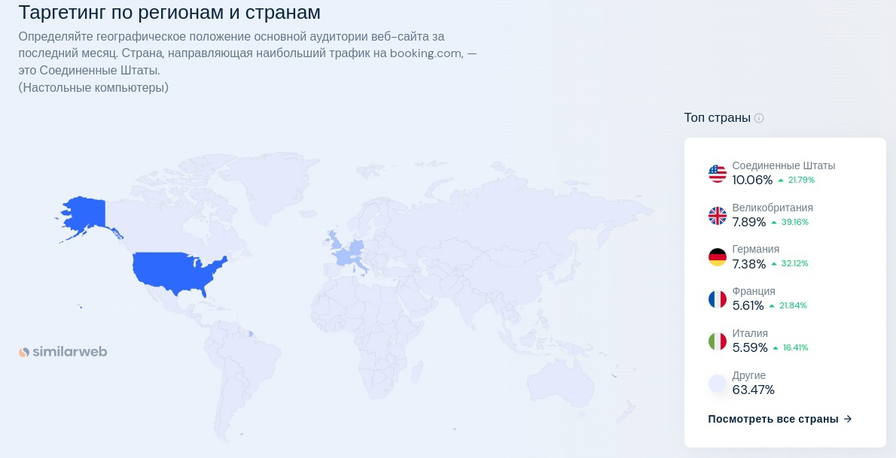

# Booking

---

## 1. Тема и целевая аудитория

**Booking.com** — система интернет-бронирования отелей, основанная в 1996 году в Амстердаме (Нидерланды).
Компания прошла путь от маленького голландского стартапа до одного из мировых цифровых лидеров в сфере путешествий. Миссия Booking.com, подразделения Booking Holdings Inc. (NASDAQ: BKNG), — делать путешествия доступными каждому.

### MVP

- Поиск с фильтрами по объявлениям.
- Объявления с фотографиями.
- Бронирование объявлений.
- Профиль арендодателя.
- Профиль арендатора.
- Статус объявления.

### Целевая аудитория

Согласно информации с [hypestat](https://hypestat.com/info/booking.com) и с [businessofapps](https://www.businessofapps.com/data/booking-statistics/):

- 500+ миллионов посещений в месяц.
- 18+ миллионов пользователей в день.
- В 2022 было забронировано 895 миллионов ночей.
- Самая многочисленная возрастная группа посетителей: 25 - 34 лет.
- В среднем, пользователи проводят на ресурсе более 8 минут за сессию.
- В среднем, пользователи на сайте открывают 8 страниц за сессию.

[Демография аудитории Booking](images/image.png)

| Страна            | Процент пользователей от общего числа |
|-------------------|:-------------------------------------:|
| Соединенные Штаты |                 10.06                 |
| Великобритания    |                 7.89                  |
| Германия          |                 7.38                  |
| Франция           |                 5.61                  |
| Италия            |                 5.59                  |

